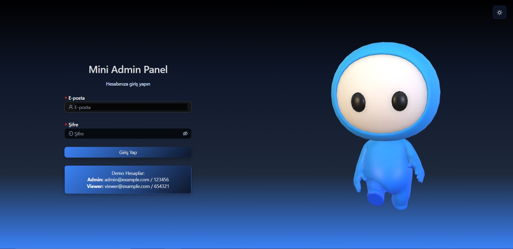
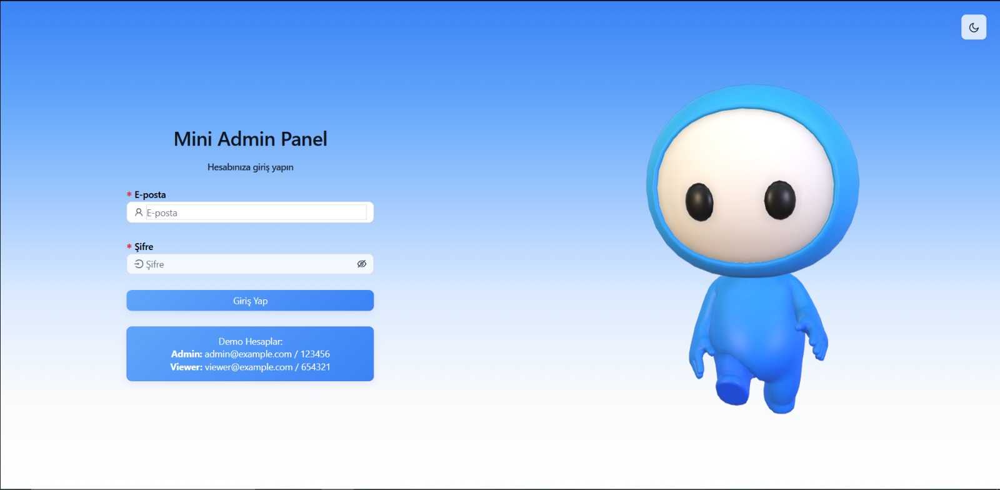
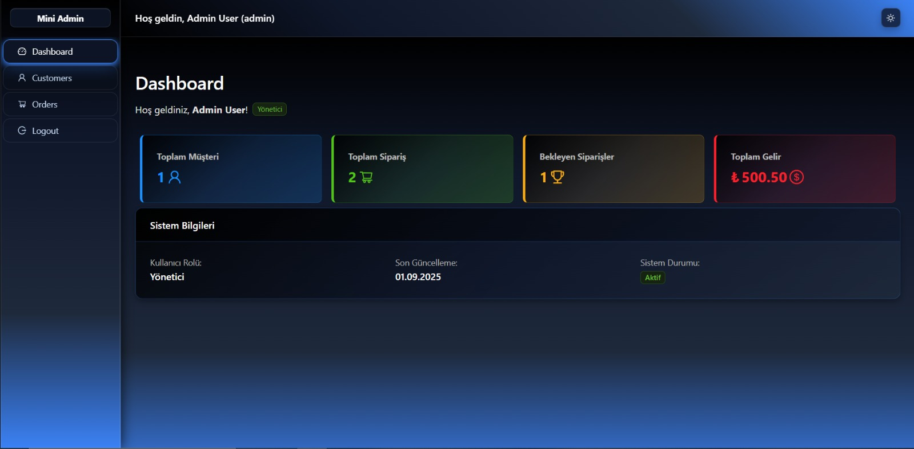
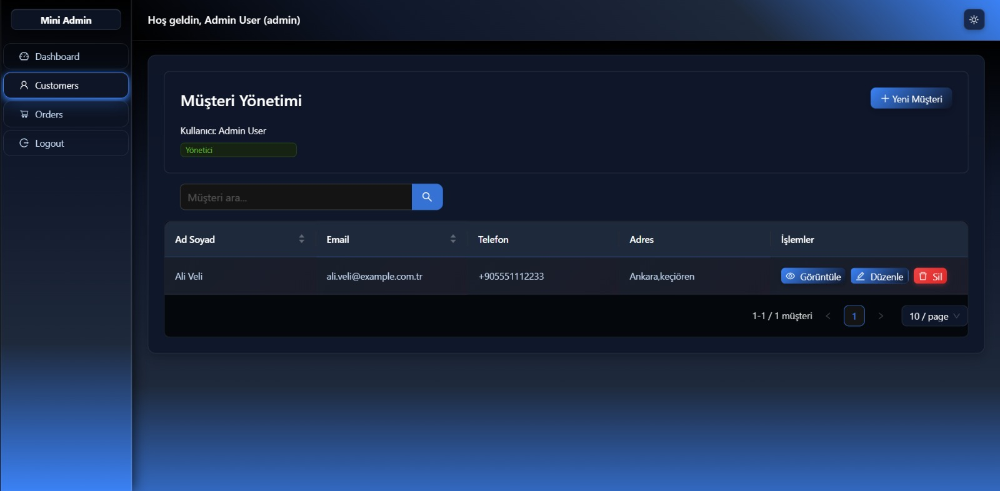
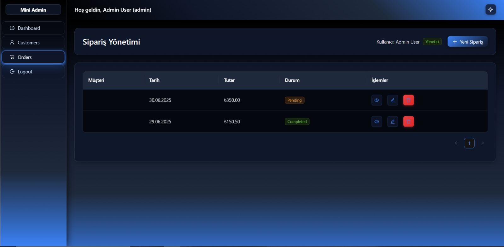
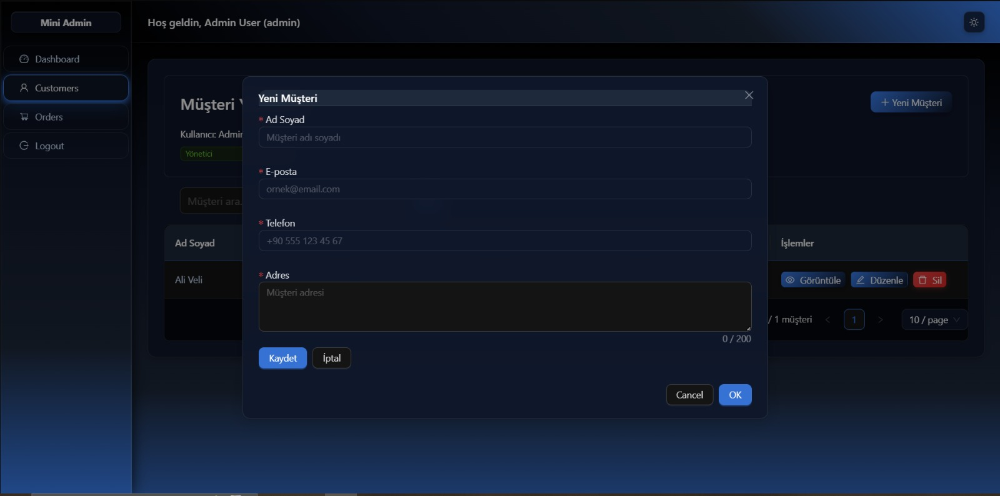
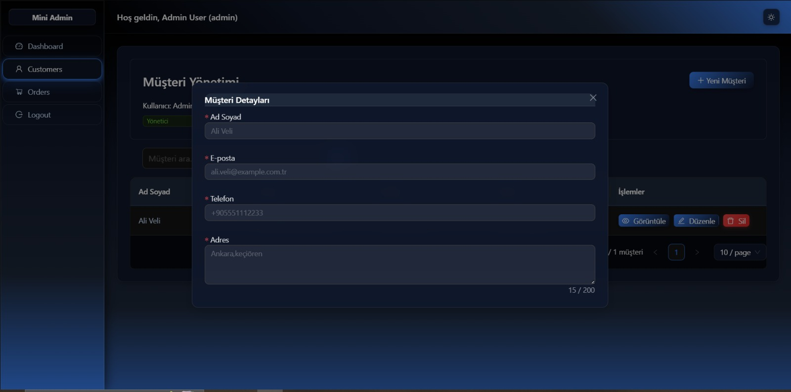
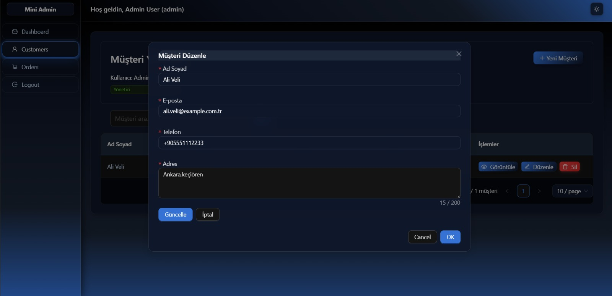
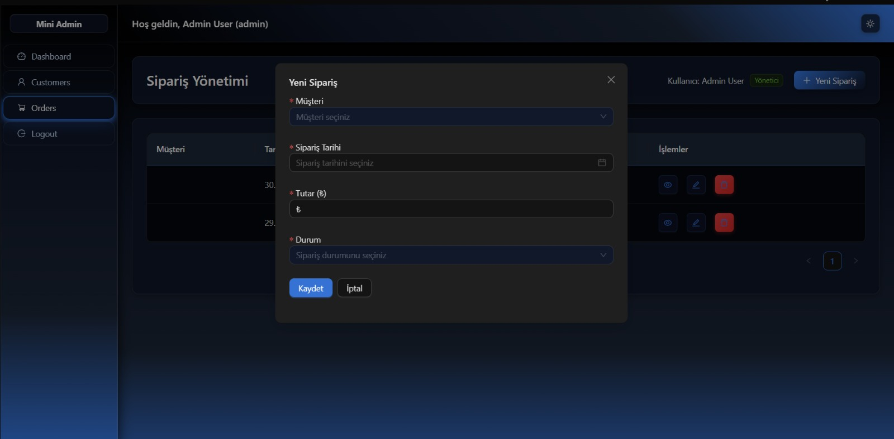
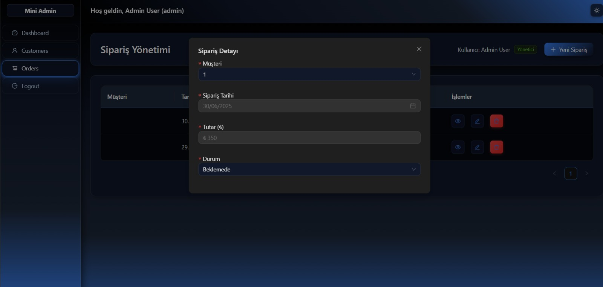

# Mini Admin Panel

🚀 A modern, responsive admin dashboard built with React, Vite, and Ant Design. This project provides a clean and intuitive interface for managing customers, orders, and dashboard analytics with authentication and theming capabilities.

## ✨ Features

- 🔐 **Authentication System** - Secure login with role-based access control
- 📊 **Dashboard** - Overview with data visualization placeholders
- 👥 **Customer Management** - CRUD operations for customer data
- 📦 **Order Management** - Complete order tracking and management
- 🎨 **Theme System** - Light/Dark theme switching
- 📱 **Responsive Design** - Mobile-friendly interface
- 🔒 **Private Routing** - Protected routes with role guards
- ⚡ **Fast Development** - Hot module replacement with Vite

## 🛠️ Tech Stack

- **Frontend**: React 18.3.1
- **Build Tool**: Vite 7.0.0
- **UI Framework**: Ant Design 5.26.3
- **Routing**: React Router DOM 6.30.1
- **HTTP Client**: Axios 1.10.0
- **Mock API**: JSON Server 1.0.0-beta.3
- **Linting**: ESLint

## 📸 Screenshots













## 🚀 Quick Start

### Prerequisites

- Node.js (v18 or higher)
- npm or yarn

### Installation

1. **Clone the repository**
   ```bash
   git clone <repository-url>
   cd mini-admin-panel
   ```

2. **Install dependencies**
   ```bash
   npm install
   ```

3. **Start the development server**
   ```bash
   npm run dev
   ```

   This command will start both the Vite development server and JSON Server concurrently:
   - React app: `http://localhost:5173`
   - Mock API: `http://localhost:3001`

4. **Open your browser**
   Navigate to `http://localhost:5173` to see the application.

## 📝 Available Scripts

- `npm run dev` - Start development server with mock API
- `npm run build` - Build for production
- `npm run preview` - Preview production build
- `npm run lint` - Run ESLint

## 🏗️ Project Structure

```
src/
├── components/           # Reusable UI components
│   ├── Forms/           # Form components
│   ├── common/          # Common components (ThemeToggle)
│   └── layout/          # Layout components (Header, Sidebar, etc.)
├── contexts/            # React contexts for state management
│   ├── AuthContext.jsx # Authentication state
│   └── ThemeContext.jsx# Theme management
├── layouts/             # Page layouts
│   └── MainLayout/      # Main application layout
├── pages/               # Page components
│   ├── DashboardPage/   # Dashboard overview
│   ├── LoginPage/       # Login interface
│   ├── CustomersPage/   # Customer management
│   └── OrdersPage/      # Order management
├── routes/              # Routing configuration
│   ├── PrivateRoute.jsx # Protected route wrapper
│   └── RouteManager.jsx # Route management
├── services/            # API service layer
│   ├── customersService.js
│   └── orderService.js
├── styles/              # Global styles
│   ├── theme.css        # Theme variables
│   └── responsive.css   # Responsive design
├── utils/               # Utility functions
│   └── RoleGuard.jsx    # Role-based access control
├── App.jsx              # Root component
└── main.jsx             # Application entry point
```

## 🔐 Authentication

The application includes a mock authentication system with role-based access control:

- **Login**: Use any credentials to access the dashboard
- **Role Guards**: Restrict access to certain components based on user roles
- **Private Routes**: Protect authenticated pages
- **Context Management**: Global authentication state

## 🎨 Theming

The application supports both light and dark themes:

- Toggle between themes using the theme switcher in the header
- Themes are managed through React Context
- CSS custom properties for consistent styling
- Responsive design across all screen sizes

## 📊 Data Management

The project uses JSON Server for mock API endpoints:

- **Customers**: CRUD operations for customer data
- **Orders**: Complete order management functionality
- **Real-time Updates**: Automatic data synchronization
- **RESTful API**: Standard HTTP methods for data operations

## 🔧 Development

### Adding New Features

1. Create components in the appropriate directory
2. Add routing in `RouteManager.jsx`
3. Implement services for API calls
4. Add styling following the existing theme structure

### Code Style

- ESLint configuration included
- Follow React best practices
- Use functional components with hooks
- Implement proper error handling

## 📱 Responsive Design

The application is fully responsive and works seamlessly across:

- **Desktop**: Full-featured layout with sidebar navigation
- **Tablet**: Adaptive layout with collapsible sidebar
- **Mobile**: Mobile-optimized interface with drawer navigation

## 🚀 Deployment

### Build for Production

```bash
npm run build
```

### Preview Production Build

```bash
npm run preview
```

The build output will be in the `dist/` directory, ready for deployment to any static hosting service.

## 🤝 Contributing

1. Fork the repository
2. Create a feature branch
3. Make your changes
4. Run tests and linting
5. Submit a pull request

## 📄 License

This project is open source and available under the [MIT License](LICENSE).

## 📞 Support

If you have any questions or need help with the project, please open an issue or contact the development team.

---

**Built with ❤️ using React, Vite, and Ant Design**
